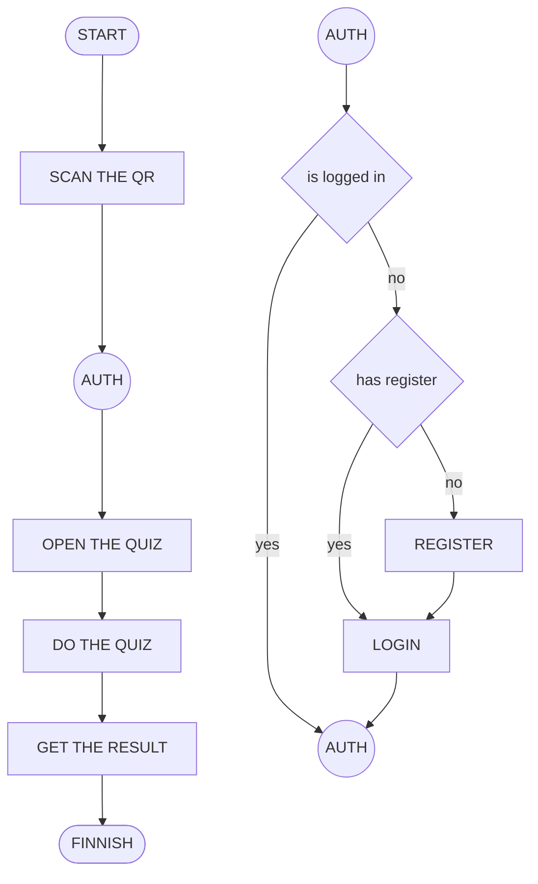
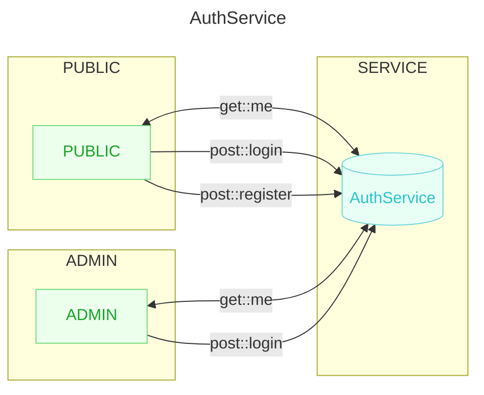
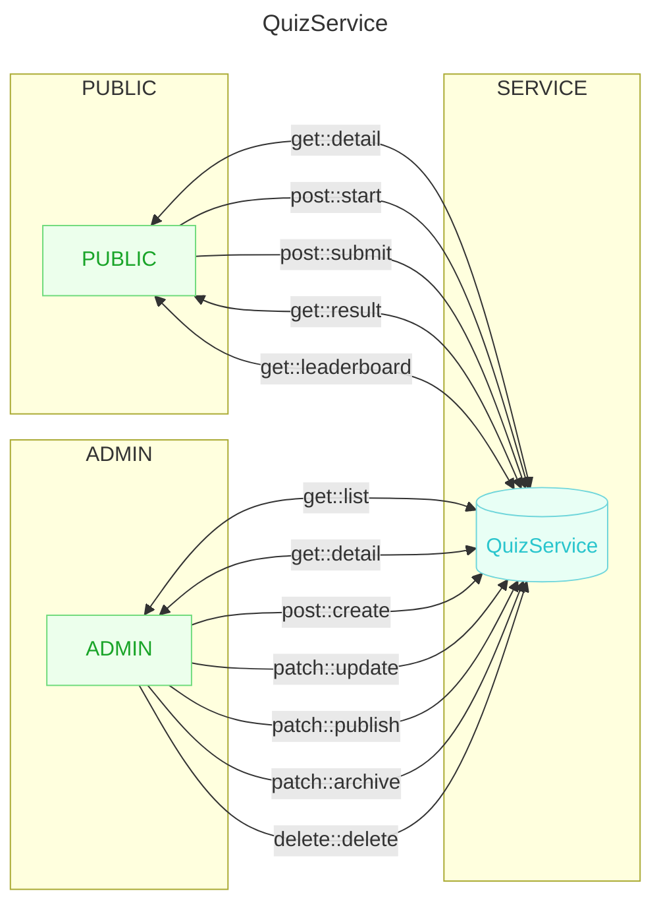
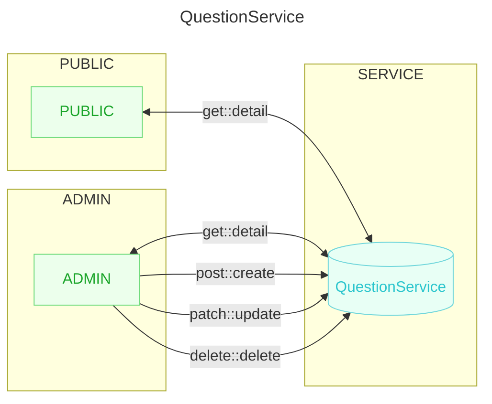

# NGUIZ

NGUIZ is an application that allows users to hunt quizzes in public places. Users can work on quizzes with attractive prizes every week.

## SYSTEM & INFRACTRUCTURE

### SERVER

Free base.

### DATABASE

This app using non sql database which is this app using mongodb.

### BACKEND

This app using NodeJS with express js framework as backend. This backend uses a model-controller architecture.

### FRONTEND

This app using React with next js framework as frontend. This frontend using modular architectire.

## REQUIREMENT

### DESIGN SYSTEM

#### FLOWCHART

#### SERVICES

